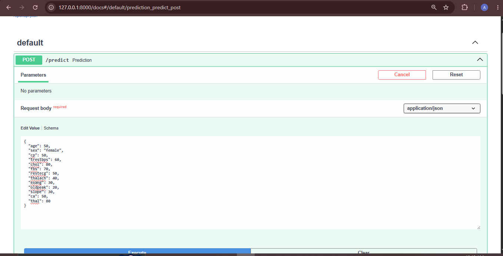
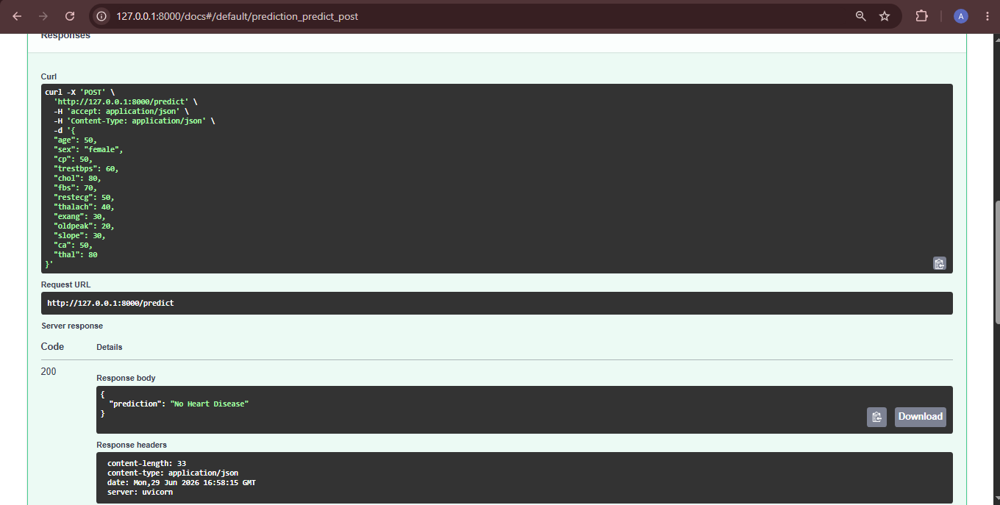

# Heart Disease Random Forest API

This project predicts whether a person has heart disease or not using a Random Forest Classifier.

The model is trained using heart disease data and deployed as an API using FastAPI.

## Features

* Random Forest Classification
* FastAPI backend
* Joblib model saving and loading
* Heart disease prediction API
* Swagger UI for API testing
* Accuracy and confusion matrix evaluation

## Algorithm Used

Random Forest Classifier

Random Forest is an ensemble machine learning algorithm. It uses many Decision Trees and combines their predictions using majority voting. It helps reduce overfitting compared to a single Decision Tree.

## Input Features

* age
* sex
* cp
* trestbps
* chol
* fbs
* restecg
* thalach
* exang
* oldpeak
* slope
* ca
* thal

## Target Classes

* No Heart Disease
* Heart Disease

## Project Structure

```text
heart-disease-random-forest-api/
│
├── assets/
│   ├── swagger.png
│   └── prediction.png
│
├── models/
│   └── heart_model.joblib
│
├── heart.csv
├── train.py
├── main.py
├── requirements.txt
├── README.md
└── .gitignore
```

## API Endpoint

POST `/predict`

## Example Input

```json
{
  "age": 50,
  "sex": "femaile",
  "cp": 50,
  "trestbps": 60,
  "chol": 80,
  "fbs": 70,
  "restecg": 50,
  "thalach": 40,
  "exang": 30,
  "oldpeak": 20,
  "slope": 30,
  "ca": 50,
  "thal": 80
}
```

## Example Output

```json
{
  "prediction": "No Heart Disease"
}
```

## How to Run

Install dependencies:

```bash
pip install -r requirements.txt
```

Train the model:

```bash
python train.py
```

Run the FastAPI app:

```bash
uvicorn main:app --reload
```

Open Swagger UI:

```text
http://127.0.0.1:8000/docs
```

## Screenshots

### Swagger UI



### Successful Prediction



## Model Evaluation

The model was evaluated using:

* Accuracy score
* Confusion matrix

## What I Learned

* How Random Forest works
* Bagging and bootstrap sampling
* Voting in Random Forest
* `n_estimators` and `max_depth`
* How to train a Random Forest model
* How to save and load a model using joblib
* How to create a FastAPI ML prediction API
* How to push an ML project to GitHub
